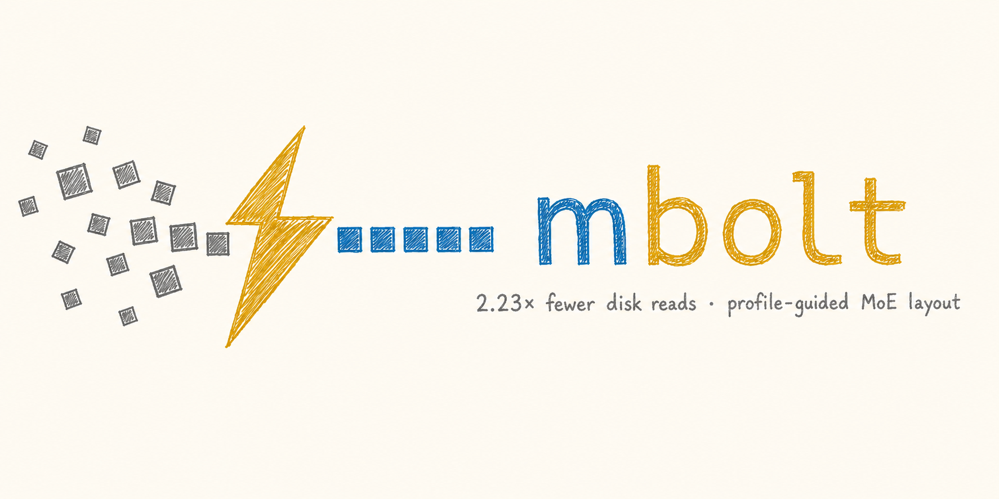
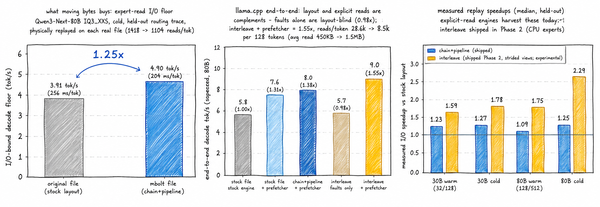

<p align="center"></p>

<p align="center">
  <a href="https://pypi.org/project/mbolt/"></a>
  
  
  
</p>

# mbolt — profile-guided layout optimization for MoE model files

<h3 align="center">Same model, same RAM, 2.23× fewer disk reads.<br>MoE experts fire in cliques; the stock file scatters them. mbolt rewrites the layout around your real routing trace.<br>1,418 → 370 reads per token. Pure profile-guided, weights byte-exact.</h3>

---

## The idea

Checkpoint tensor order is an accident of the training pipeline. But at inference time,
MoE routing is *far* from random: experts fire in cliques (23% of pairs co-activate at
>2× independence), and every decode token forces the engine to fetch dozens of expert
slices scattered across a 30GB+ file.

**mbolt does to model binaries what BOLT/PGO does to executables**: profile the real
access pattern, then move the bytes so the hot path reads sequentially.

```
stock layout:      [e0][e1][e2][e3][e4][e5] ...        token needs e1,e4,e5 -> 3 seeks
mbolt layout:      [e4][e5][e1][e0][e3][e2] ...        token needs e1,e4,e5 -> 1 read
```

Three composable pieces:

1. **Trace** — one env var (`MBOLT_TRACE`) logs which experts each token selects. No output change.
2. **Rewrite** — `mbolt model.gguf perms.json -o out.gguf` reorders expert slices by measured
   co-activation (router rows re-permuted to match, so the model computes identically).
   The `interleave` layout also packs each expert's up|gate|down as one contiguous block.
3. **Prefetch** — `MBOLT_PREFETCH` makes llama.cpp read the selected slices explicitly
   (sorted, merged, parallel `pread`s) instead of thousands of layout-blind 16KiB page faults.

The routing profile ships *inside* the file (`mbolt.perm`, `mbolt.heat`, `mbolt.tier_hint`
GGUF metadata) — any engine can consume it without re-profiling.

## What's implemented

| | component | status |
|---|---|---|
| ✅ | Routing tracer (llama.cpp patch, `MBOLT_TRACE`) | works under Metal & CPU |
| ✅ | Co-activation clustering (modularity + greedy chain ordering) | `mbolt-sim cluster` |
| ✅ | Replay simulator — predicts your speedup *before* rewriting | `mbolt-sim gate`, matched physical files to 1–3% |
| ✅ | Rewriter: `chain+pipeline` layout (reorder within tensors) | `mbolt`, loads in **unmodified** llama.cpp |
| ✅ | Rewriter: `interleave` layout (up\|gate\|down contiguous per expert) | strided-view loader patch, no per-expert tensor explosion |
| ✅ | Explicit-read prefetcher (llama.cpp patch, `MBOLT_PREFETCH`) | +31–52% alone on **any** GGUF, parallel reads |
| ✅ | 4-gate correctness CI (byte-verify · identity proof · routing equivalence · KLD envelope) | `scripts/ci_correctness.sh` |
| ✅ | Cross-domain generalization measured | dolly-trained layout → 1.22× on pure code |
| 🚧 | Safetensors/MLX port | roadmap |
| 🚧 | Upstream llama.cpp PR | staged: `doramirdor/llama.cpp:mbolt-prefetch` |

## The numbers

Qwen3-Next-80B-A3B (33GB, 512 experts/layer, doesn't fit in available RAM),
M5 Pro MacBook / APPLE SSD, CPU experts, N=3 medians:

| config | tok/s | vs stock |
|---|---|---|
| stock file, stock llama.cpp | 5.80 | — |
| stock file + prefetcher | 7.60 | 1.31× |
| reorder layout + prefetcher | 8.00 | 1.38× |
| **interleave layout + prefetcher** | **9.00** | **1.55×** |
| ↳ same, tighter memory (32GB squeeze) | 9.80 vs 6.00 | **1.63×** |

<p align="center"></p>

<sub align="center">Hand-drawn rendering; machine-generated originals + raw per-run JSON in <a href="results/">results/</a>.</sub>

Storage level (cold, physical files, held-out trace): **1,418 → ~370 reads/token (2.23×)**;
the simulator predicted 2.29× and the rewritten file delivered 2.23×. Prefetcher read
counters: 28.6k → 8.5k reads for the same ~13GB (avg read 450KB → 1.5MB).

Correctness: weights **byte-exact**, routing maps **100.000%** through the permutation at
equal inputs, output perturbation (KLD 0.00096, top-1 98.9%) is **5× below** the same
engine's CPU↔Metal backend delta. Why token-identity is impossible under *any* expert
permutation (and how we proved the rewrite isn't the cause): [results/phase1-report.md](results/phase1-report.md).

Generalization: layouts trained on general instructions still deliver **1.22×** on a
pure-code workload (in-domain 1.46×, mixed 1.61×) — profiles transfer; matched tracing buys the rest.

## Quickstart

```bash
pip install mbolt   # mbolt + mbolt-sim CLIs

# patch + build llama.cpp (adds MBOLT_TRACE / MBOLT_PREFETCH / interleave loader)
git clone https://github.com/doramirdor/mbolt && cd mbolt
git clone https://github.com/ggml-org/llama.cpp
git -C llama.cpp apply ../mbolt/patches/llama.cpp-mbolt-trace.patch
cmake -S llama.cpp -B llama.cpp/build -DCMAKE_BUILD_TYPE=Release
cmake --build llama.cpp/build --target llama-cli llama-server -j

# 1. trace YOUR workload            2. cluster           3. rewrite
MBOLT_TRACE=route.bin llama.cpp/build/bin/llama-server -m model.gguf ...
mbolt-sim cluster route.bin -o perms.json
mbolt model.gguf perms.json -o model.opt.gguf --layout interleave

# 4. decode with explicit-read prefetch
mbolt-sim prefetch-map model.opt.gguf -o opt.pfmap
MBOLT_PREFETCH=opt.pfmap llama.cpp/build/bin/llama-cli -m model.opt.gguf \
    -ot ".ffn_.*_exps.=CPU" ...

# or predict your gain first — no rewrite needed:
mbolt-sim gate model.gguf route.bin perms.json -o gate.json
```

## When it helps (and when it won't)

- Gains scale with how **I/O-bound** you are: model ≳ RAM, or storage slower than
  Apple-class NVMe. Fully-cached models see no change (there's nothing to stream).
- The layout only pays with **explicit reads** — stock llama.cpp's mmap fault path is
  layout-blind (measured: parity). Use the bundled prefetcher, or an explicit-read
  engine ([colibri](https://github.com/JustVugg/colibri)-class).
- Trace on prompts resembling your deployment mix; profiles transfer across domains
  (measured above) but matched tracing is worth ~20–30%.

Measurement discipline: cold-probe-verified page cache, N-run medians, held-out traces,
alternating run order; every number survived an adversarial recompute audit.
Reports: [phase0](results/phase0-gate.md) · [phase1](results/phase1-report.md) · [phase2](results/phase2-report.md)

## Cite

```bibtex
@misc{mbolt2026,
  title  = {mbolt: Profile-Guided Layout Optimization for MoE Model Files},
  author = {Amir, Dor},
  year   = {2026},
  url    = {https://github.com/doramirdor/mbolt}
}
```

MIT · logo & hand-drawn charts in [`assets/`](assets/)
