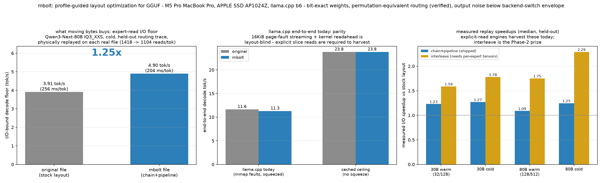

# mbolt

**Profile-guided layout optimization for MoE model files — BOLT/PGO, but for weights.**

Trace which experts your workload actually co-activates, then rewrite the GGUF so those
bytes sit together on disk. Add a 150-line prefetcher patch to llama.cpp and
memory-squeezed MoE decoding gets **1.55× faster end-to-end** — same machine, same
model, same math. Weights are byte-exact, file size +0.003%.



## Results

Qwen3-Next-80B-A3B (33 GB, 512 experts/layer), M5 Pro MacBook / APPLE SSD AP1024Z,
model can't fit in RAM (24 GB mlocked squeeze), CPU experts, 3-rep medians:

| config | tok/s | vs stock |
|---|---|---|
| stock file, stock llama.cpp | 5.80 | — |
| stock file + prefetcher | 7.60 | 1.31× |
| chain+pipeline layout + prefetcher | 8.00 | 1.38× |
| **interleave layout + prefetcher** | **9.00** | **1.55×** |

At the storage level (cold, physical files, held-out trace): 1,418 → ~370 reads/token,
**2.23× faster** — the simulator predicted 2.29× and the rewritten file delivered it.
The prefetcher alone (+13–31%) works on **any unmodified GGUF**; layouts multiply it.

Correctness (enforced by a 4-gate CI suite): weights byte-exact, routing maps 100.000%
through the permutation at equal inputs, output perturbation (KLD 0.00096, top-1 98.9%)
is **5× below** the same engine's CPU↔Metal delta. Full analysis, including why
token-identity is impossible under *any* expert permutation: [results/phase1-report.md](results/phase1-report.md).

## Quickstart

```bash
git clone https://github.com/doramirdor/mbolt && cd mbolt/mbolt
uv venv && uv pip install -e .

# patch + build llama.cpp (adds MBOLT_TRACE / MBOLT_PREFETCH, ~330 lines)
git clone https://github.com/ggml-org/llama.cpp
git -C llama.cpp apply ../patches/llama.cpp-mbolt-trace.patch
cmake -S llama.cpp -B llama.cpp/build -DCMAKE_BUILD_TYPE=Release
cmake --build llama.cpp/build --target llama-cli llama-server -j

# 1. capture routing on YOUR workload
MBOLT_TRACE=route.bin llama.cpp/build/bin/llama-server -m model.gguf ...

# 2. cluster co-activation -> permutations
mbolt-sim cluster route.bin -o perms.json

# 3. rewrite the file (layouts: chain+pipeline | interleave)
mbolt model.gguf perms.json -o model.opt.gguf --layout interleave

# 4. decode with explicit-read prefetch
mbolt-sim prefetch-map model.opt.gguf -o opt.pfmap
MBOLT_PREFETCH=opt.pfmap llama.cpp/build/bin/llama-cli -m model.opt.gguf \
    -ot ".ffn_.*_exps.=CPU" ...

# predict your gain first, without rewriting anything (physical I/O replay):
mbolt-sim gate model.gguf route.bin perms.json -o gate.json
```

## How it works

1. **Trace** — an eval-callback in llama.cpp logs the router's top-k expert ids per token per layer (`MBOLT_TRACE`, no output change).
2. **Cluster** — per layer, a co-activation graph (edge = P(i,j fire together)) → greedy modularity communities → experts ordered by a max-co-activation chain within each clique.
3. **Rewrite** — expert slices are physically permuted inside each `ffn_*_exps` tensor (router rows re-permuted to match, so the model computes identically); `interleave` packs each expert's up|gate|down adjacent using strided tensor views — no per-expert tensor explosion, ~90-line loader change.
4. **Prefetch** — when the router picks experts (a few graph nodes before the matmuls), the patch `pread()`s exactly the needed slices as sorted, merged, parallel reads into the page cache — replacing thousands of layout-blind 16 KiB page faults. On a co-activation-ordered file the ranges collapse into few ~1.5 MB sequential reads.
5. The profile ships **inside the file** (`mbolt.*` GGUF metadata: permutations, per-expert heat, tier hints) — any engine can use it without re-profiling.

## Why your results may differ

- Gains scale with how I/O-bound you are. Fast NVMe + small model + lots of RAM → compute-bound → little visible change. Slow drive / bigger model / tighter memory → the 2.2× storage win shows through.
- Routing profiles are workload-dependent; capture traces on prompts like yours (clustering held up on a disjoint test split here, but measure).
- Single-machine results so far (M5 Pro). Reproductions welcome — especially on slower drives.

## Repo map

| path | what |
|---|---|
| `mbolt/src/` | package: offset mapper, trace parser, clustering, layouts, replay simulator, CLIs |
| `mbolt/patches/` | llama.cpp patch (tracer + prefetcher + interleave loader) |
| `mbolt/scripts/` | capture, gate, correctness CI, benchmarks, charts |
| `results/phase0-gate.md` | simulator + gate report (30B) |
| `results/phase1-report.md` | rewriter + correctness + E2E root-cause (80B) |
| `results/phase2-report.md` | interleave + prefetcher: the 1.55× |

Measurement discipline throughout: cold-probe-verified page cache (macOS `F_NOCACHE`
doesn't evict existing pages; `purge` needs sudo), N-run medians, held-out traces,
alternating run order. Every number in the reports survived an adversarial recompute
audit against the raw JSONs.

## Roadmap

- Safetensors/MLX port (same pass, different container)
- Upstream llama.cpp PR for the prefetcher (staged: `doramirdor/llama.cpp:mbolt-prefetch`)
- Slower-drive-class + second-machine benchmarks
- Per-expert quantization tiers driven by measured heat (`mbolt.tier_hint` already in the file)

## Cite

```
@misc{mbolt2026,
  title  = {mbolt: Profile-Guided Layout Optimization for MoE Model Files},
  author = {Amir, Dor},
  year   = {2026},
  url    = {https://github.com/doramirdor/mbolt}
}
```

MIT license.
